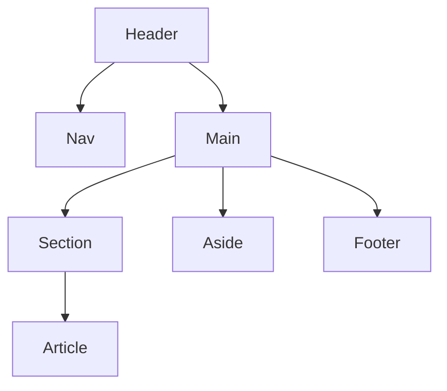

## 🗂️ Table of Contents

1. [How to Link CSS & JS: The `rel` Attribute](#1-how-to-link-css--js-the-rel-attribute)
2. [All Tags & Attributes in `<head>`](#2-all-tags--attributes-in-head)
3. [Description Lists: `dl`, `dt`, `dd`](#3-description-lists-dl-dt-dd)
4. [Table Attributes: `headers`, `scope`, `abbr`](#4-table-attributes-headers-scope-abbr)
5. [All Semantic HTML Tags](#5-all-semantic-html-tags)
6. [Visual Diagram: Semantic Layout](#6-visual-diagram-semantic-layout)
7. [Label, ARIA, and Accessibility](#7-label-aria-and-accessibility)
8. [ARIA Cheat Sheet](#8-aria-cheat-sheet)
9. [Semantic Tags vs ARIA Roles](#9-semantic-tags-vs-aria-roles)
10. [Accessibility Best Practices](#10-accessibility-best-practices)
11. [Quirks Mode vs Standards Mode](#11-quirks-mode-vs-standards-mode)

---

## 1. How to Link CSS & JS: The `rel` Attribute

The `rel` attribute in the `<link>` tag defines the relationship between the current document and the linked resource.

**Common values for `rel`:**

| rel Value      | Purpose                                 |
|---------------|-----------------------------------------|
| stylesheet    | Link a CSS file                         |
| icon          | Favicon for the page                    |
| manifest      | Web app manifest                        |
| preconnect    | Initiate early connection to a domain   |
| preload       | Preload resource (CSS, JS, fonts, etc.) |
| alternate     | Alternate version (e.g., RSS feed)      |
| canonical     | Preferred URL for SEO                   |

**Example:**
```html
<!-- Link CSS -->
<link rel="stylesheet" href="styles.css">
<!-- Favicon -->
<link rel="icon" href="favicon.ico">
<!-- Preload font -->
<link rel="preload" href="font.woff2" as="font" type="font/woff2" crossorigin>
```

**Other attributes for `<link>`:**
- `href`: URL of the resource
- `type`: MIME type (e.g., `text/css`)
- `media`: Media type (e.g., `screen`, `print`)
- `as`: Resource type for `preload`/`prefetch`
- `crossorigin`: CORS settings
- `sizes`: Icon sizes

---

## 2. All Tags & Attributes in `<head>`

The `<head>` contains metadata and resources for the page.

**Common tags/attributes:**

| Tag/Attribute         | Purpose                                      |
|----------------------|----------------------------------------------|
| `<title>`            | Page title (shown in browser tab)            |
| `<meta charset>`     | Character encoding (e.g., UTF-8)             |
| `<meta name>`        | Metadata (description, viewport, etc.)       |
| `<link rel>`         | Link to CSS, icons, manifest, etc.           |
| `<style>`            | Internal CSS                                 |
| `<script>`           | JS (rare in head, usually before `</body>`)  |
| `<base>`             | Base URL for relative links                   |

**Example:**
```html
<head>
	<title>My Awesome Page</title>
	<meta charset="UTF-8">
	<meta name="viewport" content="width=device-width, initial-scale=1.0">
	<meta name="description" content="A guide to HTML accessibility and semantics.">
	<link rel="stylesheet" href="styles.css">
	<link rel="icon" href="favicon.ico">
</head>
```

---

## 3. Description Lists: `dl`, `dt`, `dd`

- `<dl>`: Description List container
- `<dt>`: Term (name)
- `<dd>`: Description (definition)

**Example:**
```html
<dl>
	<dt>HTML</dt>
	<dd>HyperText Markup Language</dd>
	<dt>CSS</dt>
	<dd>Cascading Style Sheets</dd>
</dl>
```

---

## 4. Table Attributes: `headers`, `scope`, `abbr`

- `scope`: Specifies if a `<th>` is a row or column header (`col`, `row`)
- `headers`: Associates a `<td>` with one or more `<th>` by ID
- `abbr`: Short description for header cells (for screen readers)

**Example:**
```html
<table>
	<caption>Employee Directory</caption>
	<thead>
		<tr>
			<th scope="col" abbr="ID">Employee ID</th>
			<th scope="col">Name</th>
			<th scope="col">Role</th>
		</tr>
	</thead>
	<tbody>
		<tr>
			<td headers="id">001</td>
			<td headers="name">Alice</td>
			<td headers="role">Developer</td>
		</tr>
	</tbody>
</table>
```

---

## 5. All Semantic HTML Tags

| Tag         | Purpose                        |
|-------------|-------------------------------|
| `<header>`  | Page or section header         |
| `<nav>`     | Navigation links               |
| `<main>`    | Main content                   |
| `<section>` | Thematic grouping of content   |
| `<article>` | Self-contained content         |
| `<aside>`   | Sidebar, tangential content    |
| `<footer>`  | Page or section footer         |
| `<figure>`  | Media with caption             |
| `<figcaption>` | Caption for `<figure>`      |
| `<mark>`    | Highlighted text               |
| `<time>`    | Date/time                      |
| `<address>` | Contact info                   |
| `<details>` | Disclosure widget              |
| `<summary>` | Summary for `<details>`        |
| `<dialog>`  | Dialog/modal                   |

---

## 6. Visual Diagram: Semantic Layout



---

## 7. Label, ARIA, and Accessibility

### The `<label>` Element
- Associates text with form controls for usability and accessibility.
- Clicking the label focuses the input.
- Screen readers announce the label with the input.

**Example:**
```html
<label for="email">Email Address</label>
<input id="email" name="email" type="email">
```
Or:
```html
<label>Email Address
	<input name="email" type="email">
</label>
```

**Best Practice:** Always use a label for every input.

### ARIA (Accessible Rich Internet Applications)
- Adds accessibility info when native HTML is not enough.
- Use only when semantic HTML cannot achieve the goal.

**Common ARIA attributes:**
| Attribute         | Purpose                                 |
|-------------------|-----------------------------------------|
| `aria-label`      | Defines a label for an element          |
| `aria-labelledby` | References another element as label     |
| `aria-hidden`     | Hides element from assistive tech       |
| `aria-expanded`   | Indicates expanded/collapsed state      |
| `aria-checked`    | Checkbox/radio state                    |
| `role`            | Defines the element's role              |

**Example:**
```html
<button aria-label="Close modal">✖</button>
```

---

## 8. ARIA Cheat Sheet

| Role/Attribute         | Use Case Example                      |
|-----------------------|---------------------------------------|
| `role="button"`       | Custom clickable element              |
| `aria-checked`        | Checkbox state                        |
| `aria-expanded`       | Accordion, dropdown                   |
| `aria-hidden`         | Hide from screen readers               |
| `aria-label`          | Custom label for element              |
| `aria-live`           | Announce dynamic content              |
| `aria-modal`          | Mark modal dialogs                    |

**Accordion Example:**
```html
<button aria-expanded="false" aria-controls="panel1" id="accordion1">Section 1</button>
<div id="panel1" role="region" aria-labelledby="accordion1" hidden>
	Accordion content here.
</div>
```

---

## 9. Semantic Tags vs ARIA Roles

| Purpose         | Semantic Tag   | ARIA Role Equivalent    |
|-----------------|---------------|------------------------|
| Navigation      | `<nav>`       | `role="navigation"`   |
| Main Content    | `<main>`      | `role="main"`         |
| Article         | `<article>`   | `role="article"`      |
| Button          | `<button>`    | `role="button"`       |
| Heading         | `<h1>`-`<h6>` | `role="heading"`      |

**Best Practice:** Use semantic tags first. Use ARIA roles only when no semantic tag exists.

---

## 10. Accessibility Best Practices

1. **Use Semantic HTML** – Prefer `<nav>`, `<main>`, `<article>`, etc.
2. **Always Label Inputs** – With the `<label>` element
3. **Ensure Sufficient Color Contrast** – Minimum 4.5:1 for small text
4. **Test Keyboard Navigation** – All interactive content should be reachable by Tab
5. **Provide Useful Alt Text for Images** – Describe function and content
6. **Don’t Use Only Color to Convey Meaning** – Use icons/text
7. **Avoid Using `tabindex` > 0** – Follow natural tab order
8. **Use Landmarks/Regions** – For quick navigation (e.g., `<header>`, `<footer>`, `<main>`, `<nav>`)

---

## 11. Quirks Mode vs Standards Mode

**Quirks Mode** and **Standards Mode** are two rendering modes used by browsers to display web pages. They affect how HTML and CSS are interpreted.

### What is Quirks Mode?
- Triggered by old or missing DOCTYPE declarations.
- Browsers emulate non-standard, legacy behavior for compatibility with old sites.
- Can cause layout bugs, inconsistent box model, and unexpected results.

### What is Standards Mode?
- Triggered by a proper, modern DOCTYPE (e.g., `<!DOCTYPE html>`).
- Browsers use the latest HTML and CSS specifications.
- Ensures consistent, predictable rendering across browsers.

### Example: DOCTYPE Declaration
```html
<!-- Standards Mode (recommended) -->
<!DOCTYPE html>
<html>
	<head>...</head>
	<body>...</body>
</html>

<!-- Quirks Mode (not recommended) -->
<!-- No DOCTYPE or old/broken DOCTYPE -->
<html>
	<head>...</head>
	<body>...</body>
</html>
```

### How to Avoid Quirks Mode
- Always start your HTML files with `<!DOCTYPE html>`.
- Validate your HTML to ensure standards compliance.

**Summary Table:**

| Mode         | How Triggered           | Behavior                |
|--------------|-------------------------|-------------------------|
| Quirks Mode  | Missing/old DOCTYPE     | Legacy, non-standard    |
| Standards    | `<!DOCTYPE html>`       | Modern, standard        |

**Tip:** Use Standards Mode for all modern web development!

## 🌐 Resources
- [WebAIM: Quick Reference](https://webaim.org/resources/quickref/)
- [MDN: ARIA](https://developer.mozilla.org/en-US/docs/Web/Accessibility/ARIA)
- [Deque University](https://dequeuniversity.com/)
- [WAI-ARIA Authoring Practices](https://www.w3.org/WAI/ARIA/apg/)

---

**Tip:** Use browser accessibility tools and screen readers to test your work!
